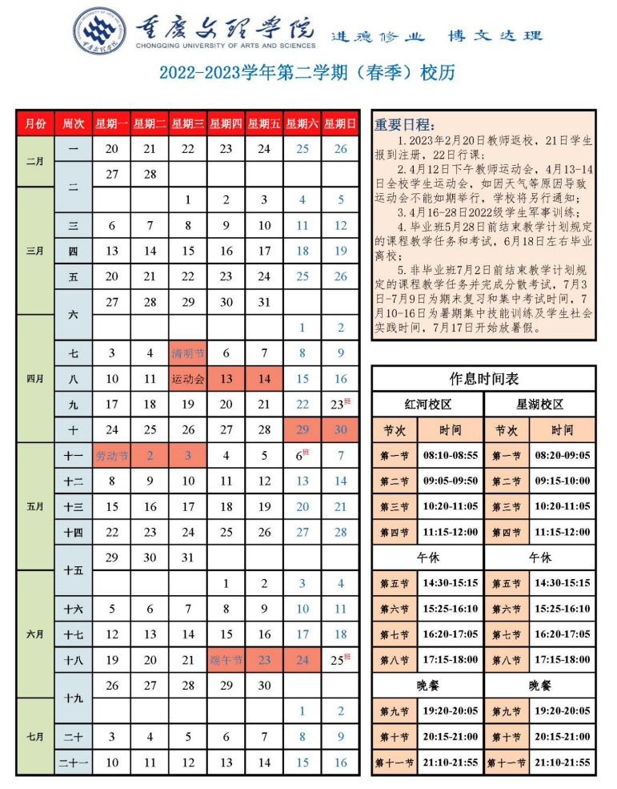

# 📅校历

## 【当前学期】2023 春季学期（共 20 周）

## 重要日程

4月12日下午教师运动会，4月13-14日全校学生运动会

4月16-28日2022级学生军事训练

毕业班5月28日前结束教学计划和考试，6月18日左右毕业离校

非毕业班7月2日前结束教学计划和分散考试，7月3-9日为复习和集中考试时间

7月10-16日为暑假集中技能训练及学生社会实践时间

7月17日开始放暑假
