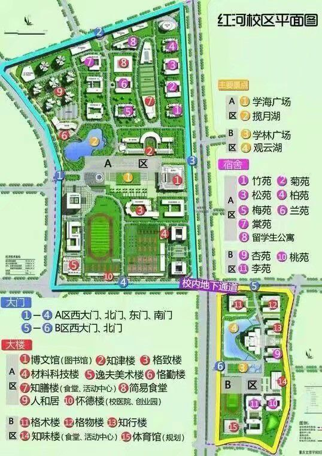

# 🏫建筑与设施

## 校园街景

[点击此处](https://720yun.com/t/b70jt54ksk6?scene_id=15601132)或通过下方的嵌入页面查看校园街景地图！

<iframe src="https://720yun.com/t/b70jt54ksk6?scene_id=15601132" name="iframe_window" width="100%" height="600" scrolling="no" allowfullscreen="true" webkitallowfullscreen="true" mozallowfullscreen="true"></iframe>

## 红河校区平面图

## 逸夫美术楼

## 篮球馆

## 田径棚

## 田径场

## 风雨球场

## 羽毛球场

## 格致楼

## 博文馆

## 知津楼

## 映梅苑（女寝）

四人间，上床下桌，三个四人间构成一个大寝室

有一个客厅（三室一厅那种），一个洗漱台，一个厕所，厕所设有 3 个蹲位 2 个喷头。

每个四人间都有空调，两个风扇，四个衣柜，一个阳台。

涉及学院：文化与传媒学院，数学与大数据学院，美术与设计学院。

## 滋兰苑（女寝）

一楼四人间，其余的楼层为六人间。

均为上下床，四人间的中间一个桌子，六人间的中间两个桌子，一个书柜，有独立的卫生间。有两个风扇，一台空调，有阳台。

涉及学院：教育学院，美术与设计学院，体育学院，数学与大数据学院，经济管理学院，文化与传媒学院。

## 听松苑（女寝）

六人间。

均为上下床，两个桌子，一个书柜，6个衣柜，有独立的卫生间。有两个风扇，一台空调，有阳台。

涉及学院：教育学院，马克思主义学院，文化与传媒学院，经济管理学院，，人工智能学院/重庆服务外包学院，美术与设计学院。

## 话竹苑（女寝）

四人间，上床下桌，三个四人间构成一个大寝室，12个人住一个大寝室。

有一个客厅（三室一厅那种），一个洗漱台，一个厕所，厕所设有 3 个蹲位 2 个喷头。

每个四人间都有空调，两个风扇，四个衣柜，一个阳台。(一楼是六张床一个大桌子，其中两个床放行李。)

涉及学院：人工智能学院/重庆服务外包学院，体育学院，马克思主义学院，文化与传媒学院，教育学院，数学与大数据学院，重庆文化遗产学院。

## 润菊苑（男寝）

六人间。

均为上下床。有两个桌子，一个书柜，独立的卫生间，一台空调，两个风扇，6个衣柜。

涉及学院：教育学院，体育学院，经济管理学院，土木工程学院，文化与传媒学院，马克思主义学院。

## 观柏苑（男寝）

四人间，上床下桌，三个四人间构成一个大寝室，12个人住一个大寝室。

有一个客厅（三室一厅那种），一个洗漱台，一个厕所，厕所设有 3 个蹲位 2 个喷头，且每个人有一个放箱子的小柜子。每个小寝室一台空调，两个风扇，一个阳台。

涉及学院：文化与传媒学院，马克思主义学院，人工智能学院/重庆服务外包学院，经济管理学院，土木工程学院。

## 赋棠苑（男寝）

六人间。

均为上下床。两张大桌子，一个书柜，6个衣柜，两个风扇，一台空调，有独立的卫生间，有阳台。

涉及学院：人工智能学院/重庆服务外包学院，数学与大数据学院，美术与设计学
院。

## 文理商场

## 学生事务中心

## 菜鸟驿站（文理商场）

## 菜鸟驿站（兰苑背后）

## 京东快递（兰苑背后）

## 邮政快递（梅苑背后）

## 第二食堂

## 第三食堂

## 安全管理处
